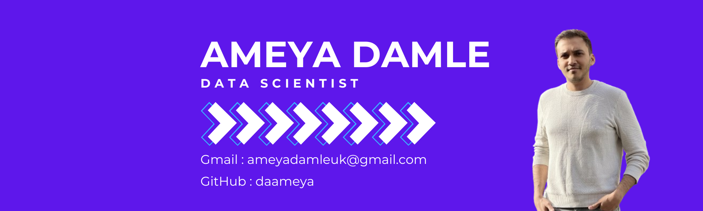

  

  

## 😊 About Me

 

📖 Bachelor’s degree in Statistics

📊 Master’s in Data Science and Advanced Computing

Data scientist with experience in delivering data solutions in the insurance domain, like fraud detection, telematics data science, 
motor/home pricing portfolio management, customer segmentation based on vertical business channels, engineered rating factors for 
pricing models, developed risk KPIs, and predicted claims outcomes. Adept in Python, SQL, R, SAS, Excel, and predictive modeling.

- Connect with me on:
  - :office: [LinkedIn](https://www.linkedin.com/in/ameya-damle/)
  - :speech_balloon: [Twitter](https://x.com/ameya98)
- 📫 Learn more about me on:
  - :pencil2: [Portfolio](https://ameyadamle.netlify.app/)
  - :bulb: [Medium](https://medium.com/@1998ameya)

## 📊 GitHub Stats:

 
 

## 🏆 GitHub Trophies

### ✍️ Random Dev Quote

---

  

<!-- Proudly created with GPRM ( https://gprm.itsvg.in ) -->

⭐️ **If you find my work interesting, feel free to star my repositories and let's collaborate on something amazing!**
